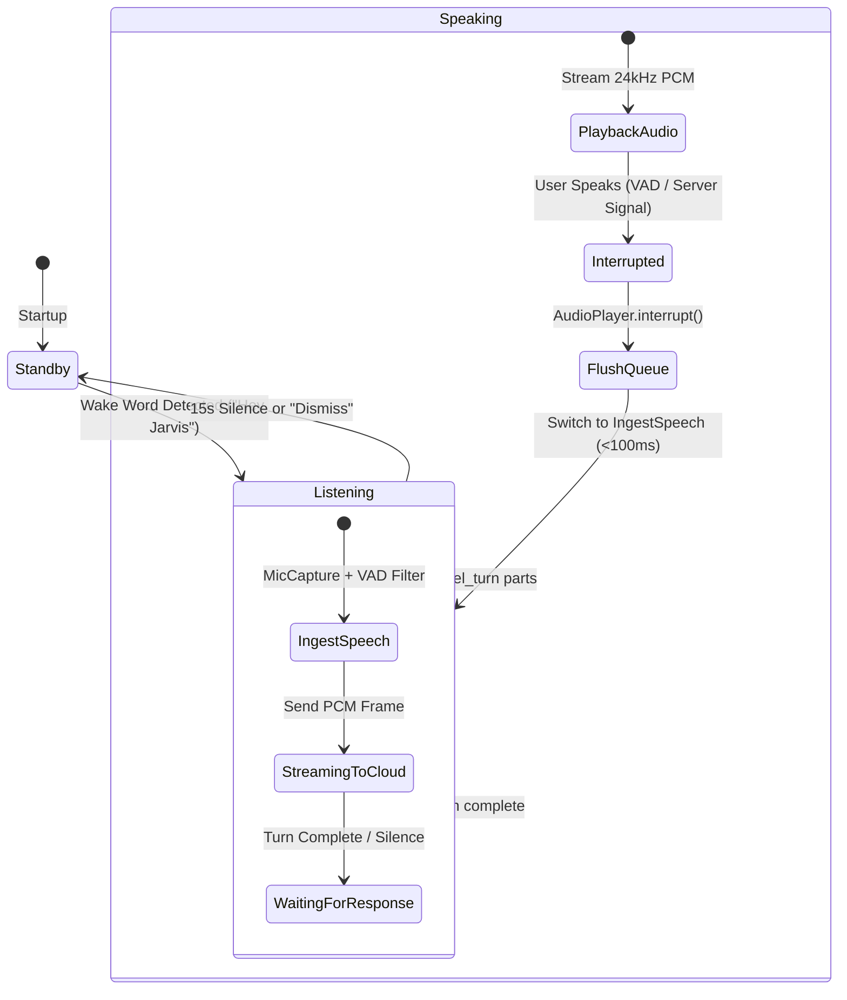

# 🏛️ Vocalis-Nexus: Architecture & Systems Engineering Reference

This document provides low-level technical specifications for **Vocalis-Nexus**, mapping acoustic hardware interfaces, WebSocket streaming protocols, and asynchronous worker orchestration.

---

## 1. Acoustic Hardware Pipeline

```text
┌────────────────────────────────────────────────────────────────────────┐
│                        MICROPHONE INGEST PIPELINE                      │
├────────────────────────────────────────────────────────────────────────┤
│  Hardware Mic                                                          │
│        │                                                               │
│        ▼ (sounddevice.InputStream, 16kHz, 1-channel, float32)          │
│  MicCapture._callback()                                                │
│        │ (Converts float32 ➔ int16 PCM bytes)                          │
│        ▼                                                               │
│  Bounded asyncio.Queue (maxsize=100)                                   │
│        │                                                               │
│        ▼                                                               │
│  Silero VAD Filter (Speech Prob >= 0.65)                               │
│        │                                                               │
│   [Is Speech?] ──NO──► Drop Frame (Zero Network / Zero Tokens)         │
│        │                                                               │
│       YES                                                              │
│        ▼                                                               │
│  session.send_realtime_input(audio=Blob(mime_type="audio/pcm;rate=16000"))
└────────────────────────────────────────────────────────────────────────┘
```

### Audio Format Standards
* **Input (Mic to Gemini)**: Raw PCM, little-endian, 16-bit signed integer, mono, **16,000 Hz** sample rate (`audio/pcm;rate=16000`). Frame blocksize: 512 samples (~32 milliseconds).
* **Output (Gemini to Speaker)**: Raw PCM, little-endian, 16-bit signed integer, mono, **24,000 Hz** sample rate. Played via dedicated worker thread in `AudioPlayer`.

---

## 2. Full-Duplex Barge-In & State Machine



### The Barge-In Invariant:
When the user speaks while Nexus is vocalizing:
1. Gemini's server-side VAD detects incoming acoustic energy.
2. The server dispatches `server_content.interrupted = True`.
3. The client invokes `player.interrupt()`, which immediately purges all queued PCM chunks from the thread queue and silences speaker output in under **100 milliseconds**.

---

## 3. Synchronous Tool Contract & Split-Brain Routing

Gemini Live API requires **synchronous function call completion**: the model will not resume spoken voice synthesis until the client returns a `LiveClientToolResponse`.

```text
Sequence of Heavy-Path Execution:
1. User: "Audit our repository and fix CI permissions."
2. Gemini emits tool_call: dispatch_job(agent="repo_architect", ...)
3. Dispatcher intercepts:
   a. Creates ticket in vocalis_jobs.json (JOB-42)        [<5ms]
   b. Fires background daemon thread worker_thread()     [<2ms]
   c. Returns immediate receipt JSON:                    [<1ms]
      {"job_id": "JOB-42", "status": "queued"}
4. Gemini immediately speaks aloud:
   "Queued JOB-42 on Repo Architect. I'm continuing to listen."
5. Worker thread executes asynchronously in background.
6. On job completion, play_completion_chime() sounds on speakers.
```

---

## 4. Ledger Schema (`vocalis_jobs.json`)

```json
{
  "next_id": 43,
  "jobs": [
    {
      "id": "JOB-42",
      "agent": "win_janitor",
      "title": "Trim RAM working set",
      "prompt": "Execute safe Win32 memory working-set sweep",
      "priority": "normal",
      "status": "COMPLETED",
      "created_at": "2026-09-22T21:00:00",
      "completed_at": "2026-09-22T21:00:14",
      "result_summary": "Reclaimed 920MB physical memory. Zero workflows disrupted."
    }
  ]
}
```

---

*Authored by **Karan Singh Verma** & Antigravity Executive Assistant.*
