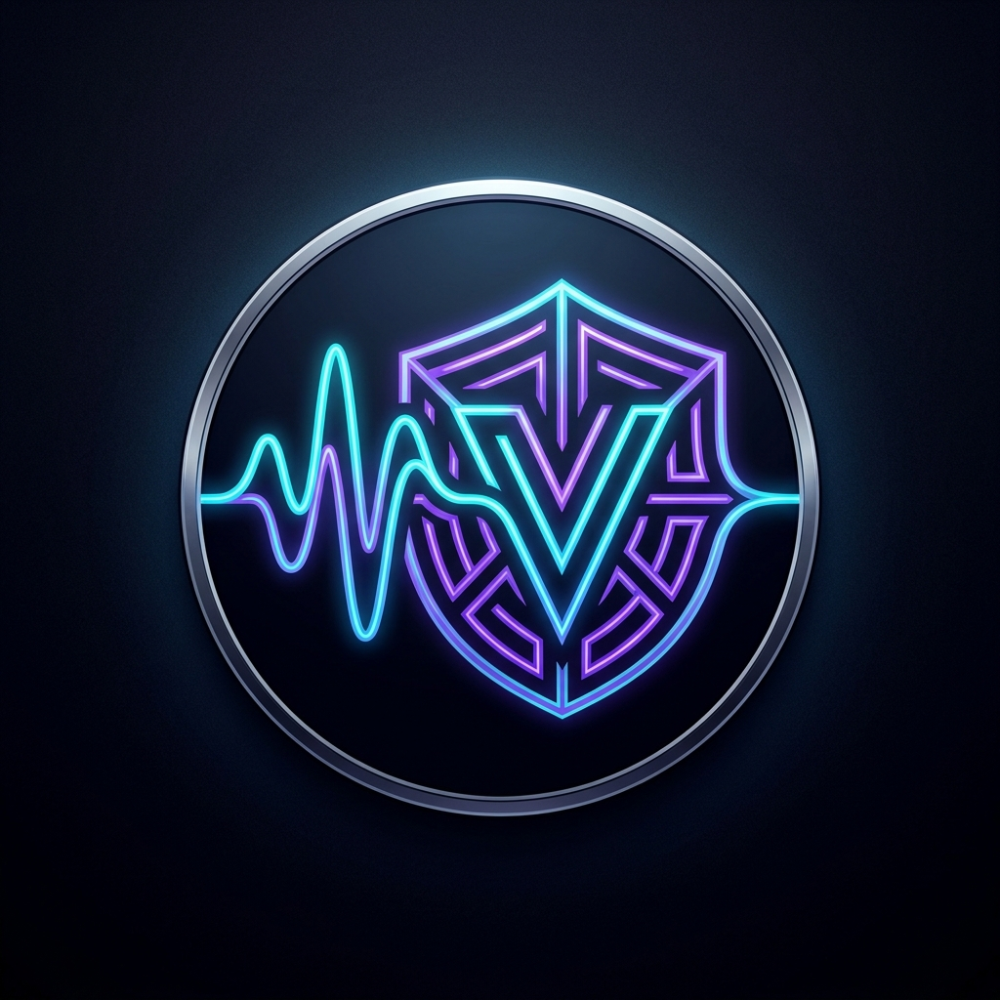
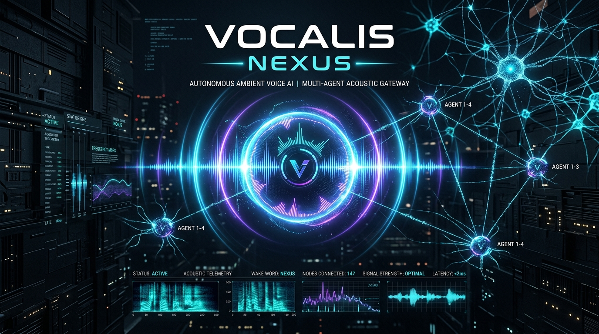
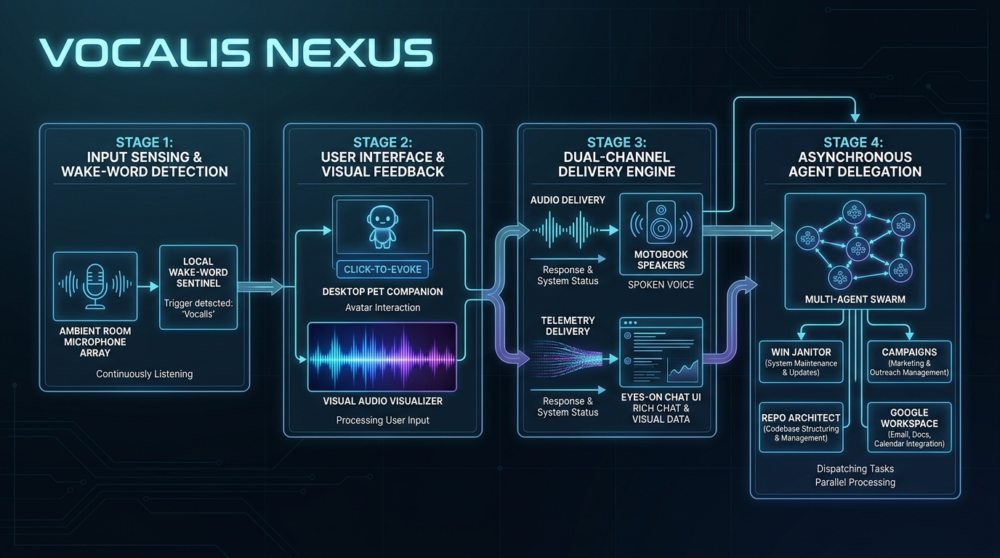
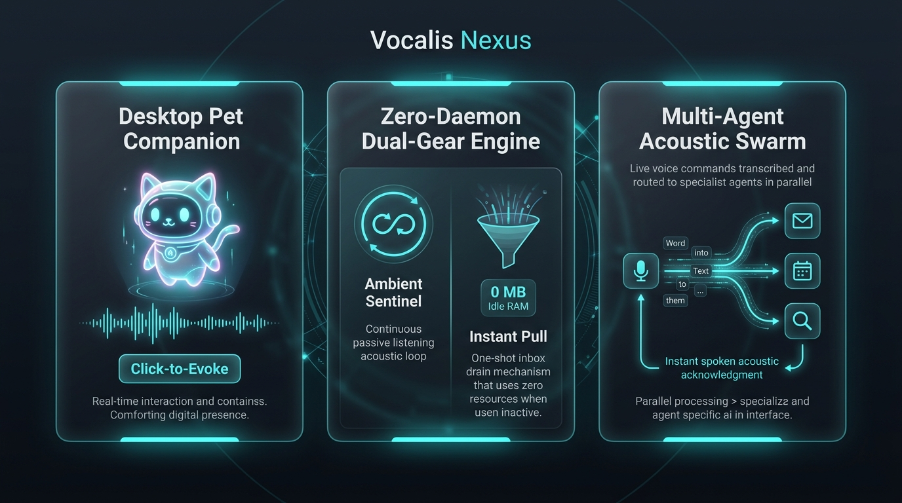

# 🎙️ Vocalis-Nexus: Sovereign Ambient Voice AI Gateway

<p align="center">
  
</p>

<p align="center">
  <a href="SECURITY.md"></a>
  <a href="LICENSE"></a>
  <a href="tests/"></a>
  
  
</p>

<p align="center">
  
</p>

> **Sovereign ambient voice-to-voice AI assistant, local wake-word sentinel, desktop pet companion, and multi-agent acoustic dispatcher for Google Antigravity.**

---

## ⚡ Architectural Blueprint: Master-Worker Acoustic Pipeline

```text
┌────────────────────────────────────────────────────────────────────────┐
│                        🎙️ VOCALIS-NEXUS ENGINE                         │
│         Sovereign Ambient Acoustic Assistant & Swarm Dispatcher         │
├────────────────────────────────────────────────────────────────────────┤
│  ⚡ Layer 0: Local Offline Ear (openWakeWord ONNX + Silero VAD) [0 TOKENS]│
│  ⚡ Layer 1: Bi-Directional Vocal Brain (Gemini Live WebSocket) [<700ms] │
│  ⚡ Layer 2: Split-Brain Router (Conversational vs Async Jobs)  [INSTANT]│
│  ⚡ Layer 3: Background Worker Swarm (Antigravity Subagents)    [ASYNC]  │
│  🔒 Sovereign Credential Vault (~/.gemini/credentials/vocalis) [SECURED]│
└────────────────────────────────────────────────────────────────────────┘
```

```text
               ┌────────────────────────────────────────────────────────┐
               │         Desktop Sentinel Captures Ambient Speech       │
               │         Appends to ~/.gemini/logs/vocalis_inbox.json   │
               └──────────────────────────┬─────────────────────────────┘
                                          │
                                          ▼
               ┌────────────────────────────────────────────────────────┐
               │         voice_wait.py exits with Code 0                │
               │         Antigravity Wakes Live Agent In-Session        │
               └──────────────────────────┬─────────────────────────────┘
                                          │
                   ┌──────────────────────┴──────────────────────┐
                   ▼                                             ▼
        [Fast-Path Query / Status]                      [Slow-Path Heavy Task]
                   │                                             │
                   ▼                                             ▼
        Formulate spoken answer                         1. Speak instant verbal ACK:
        (1-2 sentences, pure text)                         "Understood Karan, delegating
                   │                                        that to the team now."
                   ▼                                             │
        Speak aloud via speakers                                 ▼
        & display terminal card                         2. Create job ticket:
                   │                                       vocalis_create_job(...)
                   │                                             │
                   │                                             ▼
                   │                                    3. DELEGATE TO SUBAGENT SWARM:
                   │                                       invoke_subagent(...)
                   │                                       (win_janitor, repo_architect,
                   │                                        campaigns, workspace, self)
                   │                                             │
                   └──────────────────────┬──────────────────────┘
                                          │
                                          ▼
                      ══════════════════════════════════════
                      🔒 SACRED RE-ARMING IN THE SAME TURN
                      Launch voice_wait.py immediately!
                      (WaitMsBeforeAsync=500)
                      ══════════════════════════════════════
                                          │
                                          ▼
                      Agent stops calling tools to SLEEP
                      (Mic is listening; Subagent team is working)
```

<p align="center">
  
</p>

---

## 🚀 Quickstart & Operational Modes

### 1. Installation

```powershell
# Clone the repository
git clone https://github.com/karansinghverma979/antigravity-vocalis-nexus-plugin.git
cd antigravity-vocalis-nexus-plugin

# Install in development mode with core dependencies
pip install -e .
```

### 2. Central Controller Lifecycle (`scripts/listener.py`)

Manage the sentinel daemon and trigger processes from PowerShell:

```powershell
python scripts/listener.py --start    # Launch Desktop Pet daemon in background
python scripts/listener.py --status   # Inspect live acoustic telemetry & health
python scripts/listener.py --pull     # One-shot manual inbox drain (Zero background daemon)
python scripts/listener.py --stop     # Cleanly halt daemon & reactive trigger
python scripts/listener.py --test     # Test chimes & speech synthesis engine
```

### 3. Antigravity Slash Commands

Within your active Antigravity session, interact directly with the agent:

```powershell
/vocalis-nexus start    # Boots sentinel daemon & arms the live reactive in-session agent loop
/vocalis-nexus status   # Displays live sentinel status telemetry card
/vocalis-nexus stop     # Halts daemon sentinel and trigger cleanly
/vocalis-nexus pull     # Drains pending messages (0 background tasks, instant exit)
```

---

## 🎨 Feature Showcase

<p align="center">
  
</p>

### 1. 🐱 Desktop Pet Companion UI (`vocalis_daemon.py`)
- **Always-on-Top Floating Sentinel**: A tiny cyber-cat companion hovering on your screen with zero CPU lock (<0.2% idle load).
- **Click-to-Evoke**: Click directly on the Pet HUD to open the microphone immediately (0ms delay, pleasant acoustic chime, aborts active speaker output)—no wake-word required.
- **Dynamic Vector Scaling**: Scroll mouse wheel over the pet to smoothly scale between 65% and 250%, or right-click for quick presets (`Mini 70%`, `Standard 100%`, `Medium 135%`, `Large 170%`, `Jumbo 220%`). Position and size persist across reboots.
- **Acoustic Waveform Visualizer**: Real-time visual audio frequency bars pulse and animate during active speech intake.

### 2. ⚡ Dual-Gear Engine: Ambient Sentinel vs. Instant Pull
- **Gear 1: Ambient Sentinel (Automated Reactive Loop)**:
  - Invoked via: `/vocalis-nexus start`
  - Background daemon records ambient room audio, filters wake words (*"Hey Nexus"*, *"Jarvis"*, *"Antigravity"*), and appends commands to `vocalis_inbox.json`.
  - `voice_wait.py` detects pending intake and wakes the Antigravity session via reactive wakeup.
  - The live agent answers aloud through workstation speakers and re-arms the listener in the exact same turn (**The Sacred Re-Arming Invariant**).
- **Gear 2: Instant Pull / Direct Mode (One-Shot Intake)**:
  - Invoked via: `/vocalis-nexus pull` or `/vocalis-nexus direct`
  - Performs a single inbox pass, synthesizes spoken responses, prints terminal cards, and exits with **0 MB idle RAM and 0 background processes**.

### 3. 🗣️ The Spoken Answer Framing Standard (Dual-Channel Delivery)
- **For Ears (<30 words)**: 1 to 2 conversational, concise sentences spoken immediately through workstation speakers. Pure phonetics (no markdown, symbols expanded to words like *"percent"* and *"gigabytes"*).
- **For Eyes**: Full technical diffs, tables, and rich ASCII cards printed in the terminal chat window.

### 4. 🐝 Multi-Agent Swarm Orchestration
The master dispatcher agent (`vocalis_nexus`) operates under the **Commander Doctrine (Zero Heavy Self-Work)**:
- Heavy tasks (coding, refactoring, sweeps, audits) are immediately assigned ticket numbers (`JOB-XX`).
- Delegated via `invoke_subagent` to specialist agents:
  - `win_janitor`: RAM working-set trimming, bloat eradication, telemetry disabling.
  - `campaigns`: SQLite tactical operations, daily strike tracking, treasury HUD.
  - `repo_architect`: GitHub repositories, OpenSSF CI/CD, documentation progressive disclosure.
  - `google_workspace`: Drive, Docs, Gmail, Calendar, Sheets, Tasks.
  - `play_console`: Android App Bundles, Play Console release tracks.
  - `self` / `research`: Code writing, tests, deep web exploration.
- The master dispatcher announces acoustic verbal ACK (*"Understood Karan, starting that with the specialist team now."*), re-arms `voice_wait.py` immediately, and sleeps while the swarm crunches.

---

## 🔊 Multi-Voice Studio Engine & Acoustic Overdrive

Vocalis-Nexus features an enterprise multi-voice palette configurable on the fly:

```powershell
# Test Google Assistant natural voice
python -m vocalis.tools.speak --voice google-in --text "Namaste Karan! System telemetry is nominal."

# Test Edge-TTS Madhur neural voice
python -m vocalis.tools.speak --voice madhur --text "All background tasks completed successfully, sir."
```

| Voice ID | Engine | Accent / Style | Role |
| :--- | :--- | :--- | :--- |
| `google-in` | gTTS | Indian English (Natural) | **Default Assistant ⭐** |
| `google-hi` | gTTS | Pure Hindi (Conversational) | Regional Assistant |
| `madhur` | Edge Neural | Indian Male (`hi-IN-MadhurNeural`) | Warm & Expressive |
| `jarvis` | Edge Neural | Indian English Male (`en-IN-PrabhatNeural`) | Technical Advisor |
| `neerja` | Edge Neural | Indian English Female (`en-IN-NeerjaExpressive`) | Executive Briefing |
| `ava` | Edge Neural | US Female (`en-US-AvaMultilingual`) | Clean Modern |
| `brian` | Edge Neural | US Male (`en-US-BrianMultilingual`) | Authoritative Deep |
| `native` | Win32 SAPI | Windows Native SpeechSynthesizer | 100% Offline Fallback |

### Acoustic Overdrive (+400% Digital Gain & Master Hardware Governor)
1. **CoreAudio Master Hardware Governor (`volume.ps1`)**: Direct C#/Win32 `IAudioEndpointVolume` hook to read and force Windows master output to **100% (1.0 scalar)**, unmuting the default speaker endpoint.
2. **Acoustic Overdrive (+400% Digital Pre-Amp Gain)**: Multi-stage `ffmpeg` audio filter chain:
   ```text
   volume=4.0,dynaudnorm=f=75:g=21,alimiter=limit=0.98
   ```
   - **`dynaudnorm`**: Dynamic audio normalizer pulls quiet speech frequencies up to maximum audible loudness.
   - **`alimiter`**: True-peak brickwall limiter prevents physical laptop speaker buzzing and clipping.
3. **MCI Channel Locking**: Forces `winmm.dll` MCI playback channel to maximum `1,000 / 1,000`.

---

## 🧪 Verification & Test Suite

All 11 subsystems pass rigorous standalone testing:

```powershell
python -m tests.run_tests
```

```text
=======================================================
  🎙️ VOCALIS-NEXUS: STANDALONE TEST SUITE VERIFICATION
=======================================================

  [PASS] Config: Default constants and environment loader
  [PASS] Job Registry: Thread-safe ticket CRUD and lifecycle
  [PASS] Dispatcher: Split-brain tool router (dispatch_job & telemetry)
  [PASS] Notifications: Pure Python PCM tone synthesis
  [PASS] Telemetry: Safe metric extraction without crashes
  [PASS] MCP Server: Stdio JSON-RPC protocol compliance
  [PASS] Voice Inbox: Thread-safe queue FIFO & barge-in state
  [PASS] Desktop Pet UI: Canvas rendering, vector scaling & Click-to-Evoke
  [PASS] Wake Word Sentinel: Energy pre-gating, EMA temporal smoothing & debounce
  [PASS] Speech Synthesis: Phonetic sanitization & --text flag
  [PASS] Lifecycle Controller: Listener telemetry & status query

Results: 11 passed, 0 failed.
All systems verified successfully!
```

---

## 🔒 OpenSSF Hardening & Security Standards

- **Rule Zero Credential Quarantine**: API keys and tokens reside strictly in `%USERPROFILE%\.gemini\credentials\vocalis-nexus\config.env`. Zero credentials staged in git.
- **Zero Local Machine Paths**: Portable dynamic home expansion (`Path.home()`, `~/.gemini/`) throughout code and documentation.
- **Decoupled Runtime State**: All audio caches, SQLite logs, and runtime queues live in `%LOCALAPPDATA%` or `~/.gemini/logs/`.
- **Pinned CI/CD Actions**: All GitHub Actions workflows in `.github/workflows/` are pinned to immutable 40-character commit SHAs.

---

## 📄 License & Attribution

Distributed under the **MIT License**. See [`LICENSE`](./LICENSE) for full details.

*Engineered by **Karan Singh Verma** & Antigravity Executive Assistant.*
